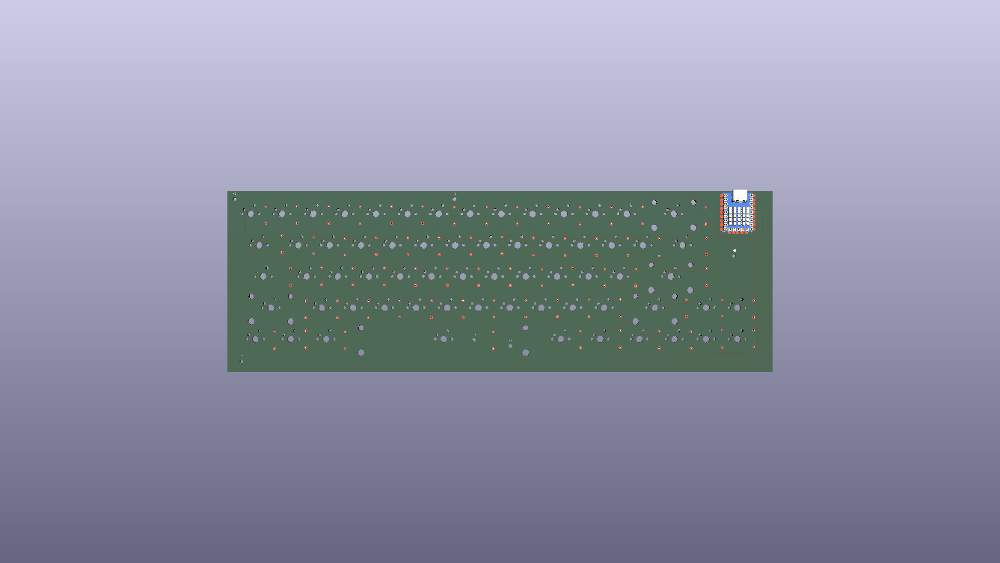
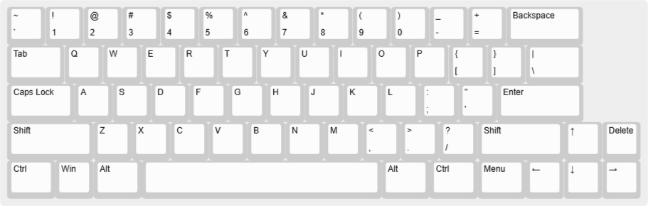
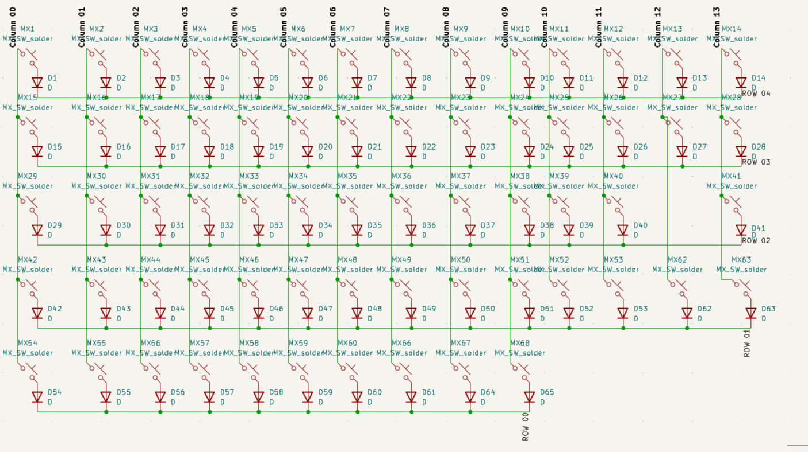
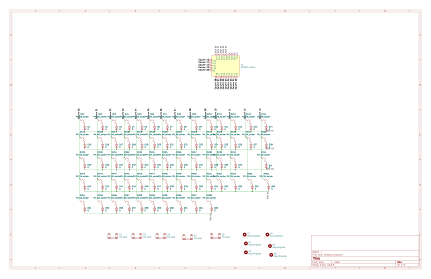
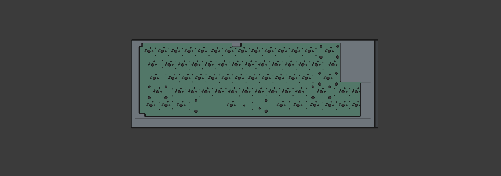
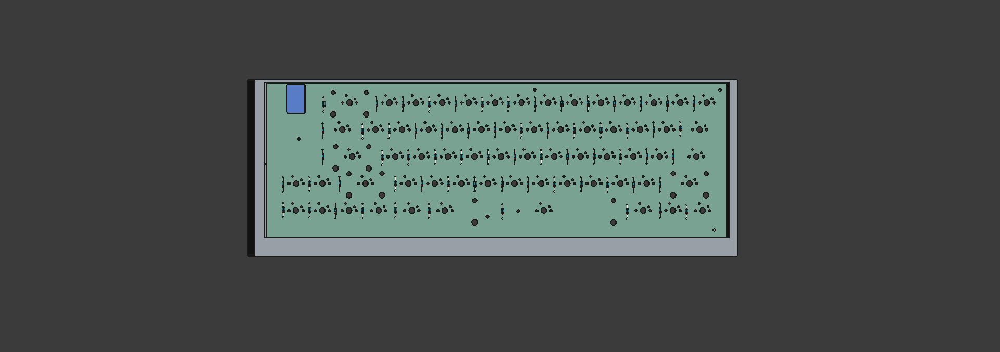

# KEY65

<p align="center">
  
</p>

<p align="center">
  A custom 65% mechanical keyboard built from scratch.
</p>

<p align="center">
  <b>RP2040</b> · <b>MX-compatible switches</b> · <b>Custom PCB</b>
</p>

---

## Overview

KEY65 is a custom 65% mechanical keyboard designed and built from scratch.

The project includes a custom PCB, matrix-based key scanning, RP2040 firmware, rotary encoder support, and a custom plate/layout.

The goal was to understand the complete process of building a mechanical keyboard — from schematic and PCB design to firmware and final assembly.

---

## Features

* 65% keyboard layout
* RP2040-based controller
* MX-compatible mechanical switches
* Diode-per-switch matrix
* Custom-designed PCB
* USB connectivity
* Programmable keymap
* Custom platei
* Open-source hardware and firmware

---

## Layout

<p align="center">
  
</p>

## Hardware

### Controller

The keyboard uses an **RP2040** microcontroller.


## PCB

The PCB was designed in KiCad.

<p align="center">
  
</p>

### PCB files

The complete KiCad project is available in:

```text
hardware/
├── project/
├── schematic/
├── pcb/
└── gerbers/
```

Gerber files are included so the PCB can be manufactured directly.

---

## Schematic

<p align="center">
  
  
</p>

The schematic contains:

* RP2040 controller
* Keyboard matrix
* Switch diodes
* Rotary encoder
* USB connection
* Power connections

---

## 3D Design

<p align="center">
  
  
  
</p>

A 3D model/render of the PCB and keyboard assembly is included for reference.

---

## Firmware

The firmware is located in:

```text
firmware/
```

The main configuration files are:

```text
firmware/
├── key65.toml
└── keymap.toml
```

### Flashing

For a supported RP2040 board:

1. Connect the controller through USB.
2. Enter bootloader mode.
3. Flash the provided `.uf2` firmware.
4. Reconnect the keyboard.
5. Test the key matrix and rotary encoder.

The compiled firmware is available in:

```text
firmware/build/
```

---

## Bill of Materials

| Component              |    Quantity |
| ---------------------- | ----------: |
| RP2040 controller      |           1 |
| MX-compatible switches |         65+ |
| 1N4148 diodes          |         65+ |
| Keycaps                |         65+ |
| PCB                    |           1 |
| Stabilizers            | As required |
| USB connector          |           1 |

See [`bom.csv`](bom.csv) for the complete BOM.

---

## Repository Structure

```text
key65/
├── firmware/       # Keyboard firmware and compiled builds
├── hardware/       # KiCad schematic, PCB and manufacturing files
├── plate/          # Plate design
├── docs/            # Documentation and images
├── bom.csv             # Bill of materials
├── README.md
└── LICENSE
```

---

## Build

The general assembly process is:

1. Manufacture the PCB.
2. Solder the diodes.
3. Solder the controller.
4. Solder the switches and other components.
5. Install stabilizers.
6. Install the plate and keycaps.
7. Flash the firmware.
8. Test every key.
9. Assemble the final keyboard.

